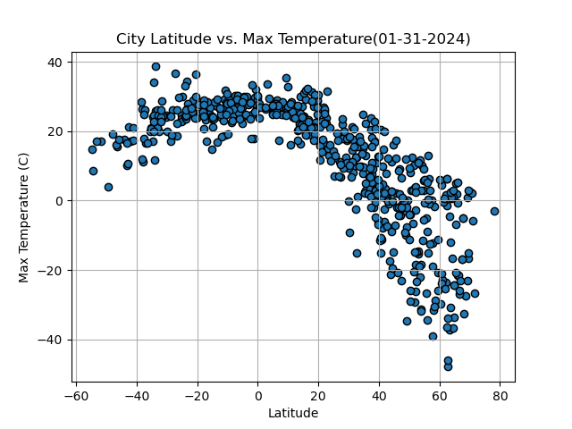

# python_api_challenge

## Repository Overview 
- All data regarding this analysis can be found in the folder labeled 'WeatherPy'.
- Individual graphs and other outputs can be found in the 'output_data' folder inside 'WeatherPy'.

## Background 
Data's true power is its ability to definitively answer questions. So, let's take what you've learned about Python requests, APIs, and JSON traversals to answer a fundamental question: "What is the weather like as we approach the equator?"

Now, we know what you may be thinking: “That’s obvious. It gets hotter.” But, if pressed for more information, how would you prove that?

# Analysis

## City Latitude vs. Max Temperature 

Overall, there is a strong correlation between the latitude of a city and it's Max Temperature. As expected, the closer you get to the equator, the higher the average max temperature is going to be. There is also a noticeable weaker correlation in the southern hemisphere graphic because the furthest point that humans permanently live is around 55 degrees S whereas in the northern hemisphere the furthest point is close to 80 degress N.

