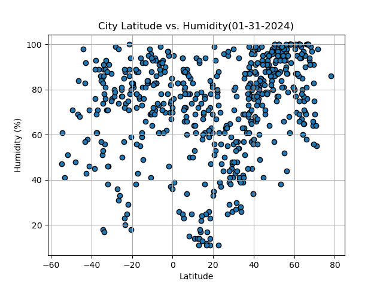
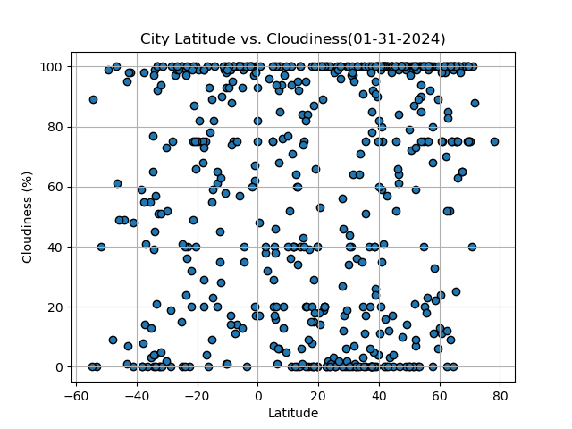
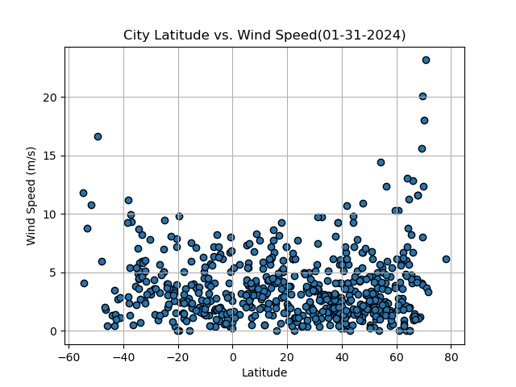

# python_api_challenge

### Repository Overview 
- All data regarding this analysis can be found in the folder labeled 'WeatherPy'.
- Individual graphs and the CSV file of the collected data can be found in the 'output_data' folder inside 'WeatherPy'.

### Background 
Data's true power is its ability to definitively answer questions. So, let's take what you've learned about Python requests, APIs, and JSON traversals to answer a fundamental question: "What is the weather like as we approach the equator?"

Now, we know what you may be thinking: “That’s obvious. It gets hotter.” But, if pressed for more information, how would you prove that?

# Analysis

### City Latitude vs. Max Temperature 

Overall, there is a strong correlation between the latitude of a city and it's Max Temperature. As expected, the closer you get to the equator, the higher the average max temperature is going to be. There is also a noticeable weaker correlation in the southern hemisphere graphic because the furthest point that humans permanently live is around 55 degrees S whereas in the northern hemisphere the furthest point is close to 80 degress N.

### City Latitude vs. Humidity

When comparing the latitude to the humitity of a city, there is a noticeable weak correlation in both hemispheres in terms of humidity vs. latitude. This makes sense as humidity is based on a number of variables other than distance from the equator.

## City Latitude vs. Cloudiness 

As cloudiness is generally more based on weather patterns, there is a weak correlation between the latitude location of a city and cloudiness in both the nothern and southern hemisphere. 

## City Latitude vs. Wind Speed 

Out of all the relationships that I analyized, the correlation between cloudiness and the latitude location of a city is at most very weak. There is a very weak correlation between wind speed and latitude in the southern hemisphere. In the northern hemisphere, there is virtually no correlation. 

# Conclusion
In conclusion, the most reliable way to predict weather conditions as we get closer or further away from the equator is to assume that as you get closer, the temperatures get higher and vise versa. 
